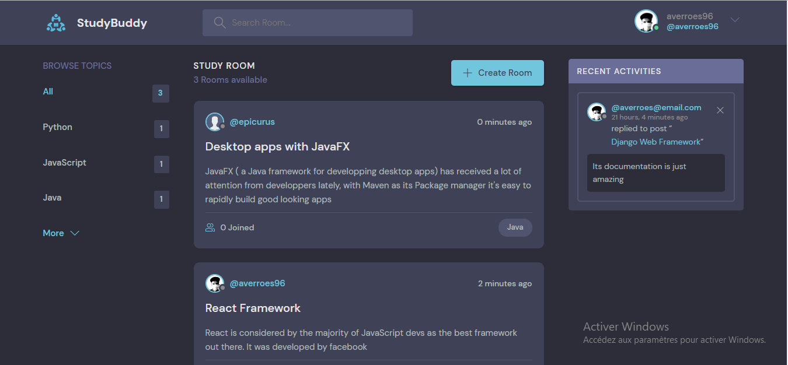

# django-demo
Project i realised while learning Django framework

## Things i've learned

* What is Django
* Resources & Environment setup
* Installation & Setup
* Views & Urls
* Models & Forms creation
* Templates creation
* Database, Migrations & Admin panel
* CRUD Operations
* Search functions
* Authentification
* Flash Messages
* Static files
* REST Framework
* CORS Handling

## Final Result

## Tutorial

[Dennis Ivy - Traversy Media](https://www.youtube.com/watch?v=PtQiiknWUcI)

